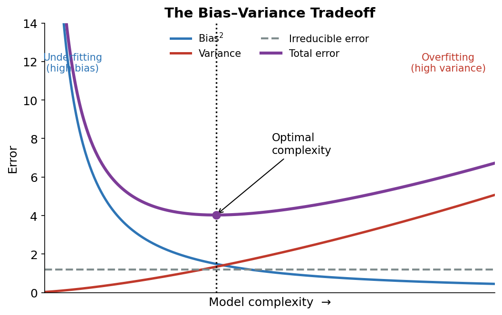
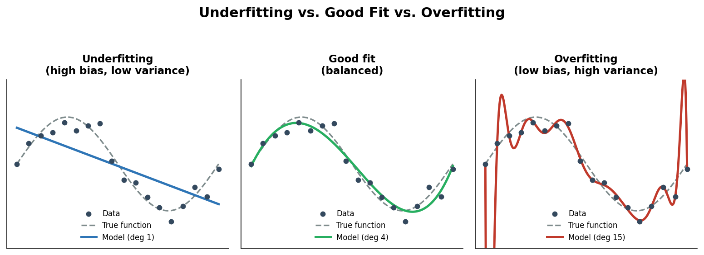
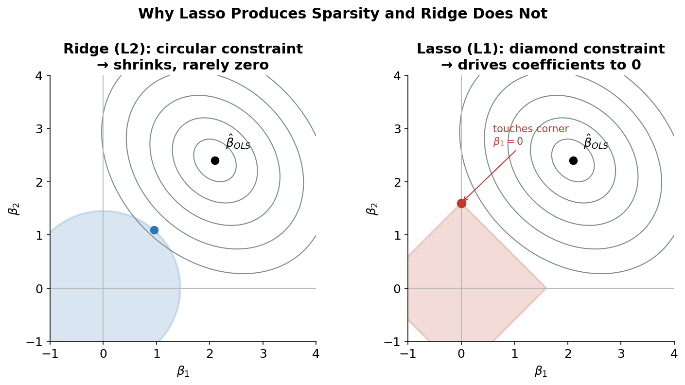
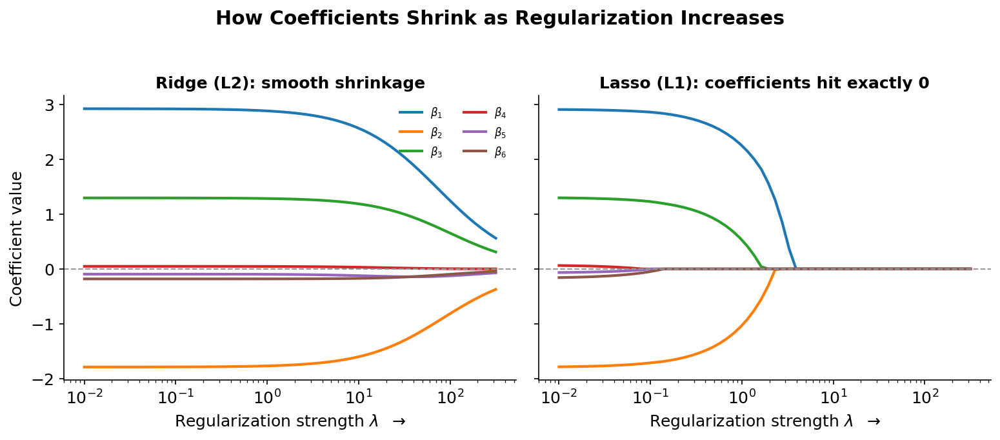
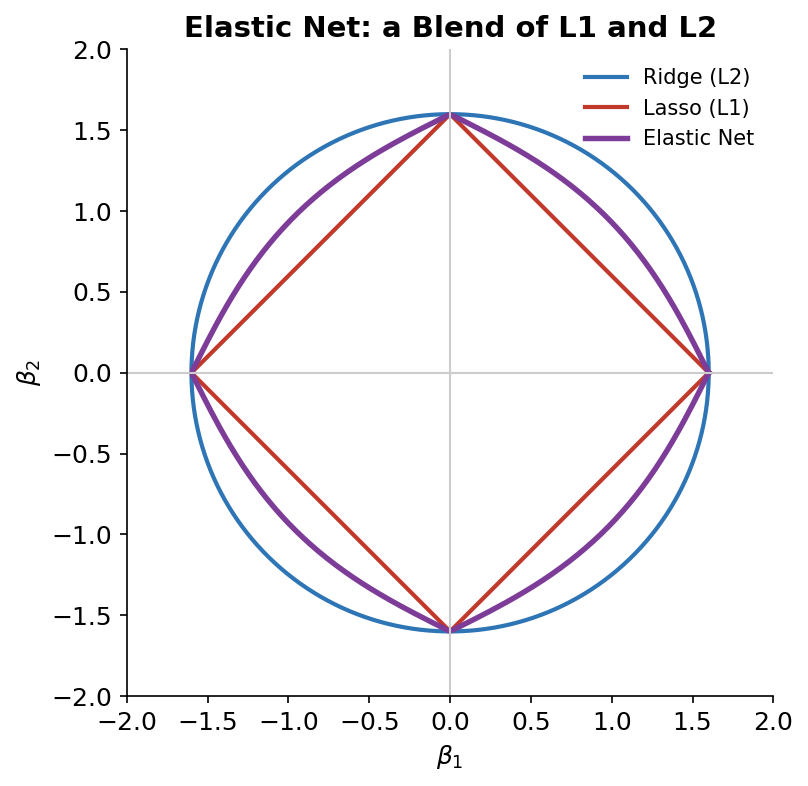

# Regularization in Machine Learning

*Bias & Variance · Ridge · Lasso · Elastic Net*

---

### 1. What Is Regularization?

**Definition.** Regularization is a set of techniques that add a penalty for model complexity to the training objective. Instead of only minimizing the error on the training data, the model also pays a price for having large coefficients. This discourages it from fitting every quirk and noise point in the training set, which keeps the model simpler and helps it perform better on new, unseen data.

In a standard linear model we minimize just the prediction error (for example, the residual sum of squares, RSS). Regularization changes the goal to:

> *Cost = Prediction error (RSS) + λ × (penalty on coefficient sizes)*

Here **λ (lambda)** is the regularization strength — a knob you tune. A larger λ means a stronger penalty and simpler model; λ = 0 means no regularization at all. In short, regularization deliberately accepts a little more **bias** in exchange for a large drop in **variance**.

**Real-Time Example**

**Predicting house prices.** Imagine a real-estate company building a model to predict house prices from 150 features — square footage, bedrooms, bathrooms, age, school rating, distance to city, and dozens of neighborhood and amenity indicators. With so many features and only a few thousand sales records, an ordinary regression starts **memorizing noise**. It might learn an oddly large weight for something like "house number is even" or "listed on a Tuesday" — patterns that happened to correlate with price in the training data purely by chance.

When this over-fitted model is shown **new listings**, those spurious patterns don't hold, and its predictions swing wildly — classic **high variance**. By adding a regularization penalty, the model is pushed to keep all those coefficients small. The weights on weak, noisy features shrink toward zero, while genuinely predictive signals like square footage and location keep meaningful weights. The result is a simpler, more stable model whose price predictions hold up on houses it has never seen.

The same idea powers everyday systems: **credit-risk scoring** (hundreds of customer attributes), **spam and fraud detection**, and **recommendation engines** — anywhere there are many features and a real risk of fitting noise.

### 2. Bias and Variance

Every model's expected error on new data can be broken into three parts:

> *Total Error = Bias² + Variance + Irreducible Error*

**Bias** is error from overly simplistic assumptions. A high-bias model is too rigid to capture the real pattern in the data, so it **underfits** — it is wrong in the same way on both training and test data. Example: fitting a straight line to data that is clearly curved.

**Variance** is error from being too sensitive to the specific training data. A high-variance model changes a lot if you give it slightly different data; it captures noise as if it were signal and **overfits**. It looks excellent on training data but fails on new data.

**Irreducible error** is the noise inherent in the problem itself — no model can remove it.

#### The Bias–Variance Tradeoff

Bias and variance pull in opposite directions. As you make a model more complex, bias goes down (it fits the data better) but variance goes up (it gets more sensitive to noise). As you make it simpler, the reverse happens. You cannot minimize both at once — this tension is the **bias–variance tradeoff**. The goal is the sweet spot that minimizes **total** error, shown at the bottom of the purple curve below.

*Figure 1 — As complexity rises, bias² falls and variance rises; total error is minimized at an optimal middle point.*

Visually, the same story plays out in how a model fits data. Too simple and it misses the trend (underfitting); too complex and it chases every point including noise (overfitting); the middle captures the real shape.

*Figure 2 — Underfitting (high bias) vs. a balanced fit vs. overfitting (high variance).*

Regularization is one of the main tools for **controlling** this tradeoff: turning up λ moves a model from the right side (overfitting) toward the left (more bias), letting you settle near the optimal point.

### 3. Why Use Regularization?

- **Prevent overfitting.** The primary reason — it stops the model from memorizing training noise so it generalizes to new data.
- **Reduce variance.** Shrinking coefficients makes predictions far more stable across different datasets.
- **Handle multicollinearity.** When predictors are highly correlated, ordinary regression produces unstable, wildly swinging coefficients. Regularization (especially Ridge) stabilizes them.
- **Automatic feature selection.** Lasso can zero out irrelevant features, leaving a simpler, more interpretable model.
- **Work in high dimensions.** When there are more features than samples (p > n), ordinary regression breaks down; regularization makes the problem solvable.
- **Improve interpretability.** Fewer, smaller coefficients are easier for people to understand and trust.

### 4. Ridge Regression (L2 Regularization)

Ridge regression adds a penalty equal to λ times the **sum of the squared coefficients** (the L2 norm).

> *Minimize: RSS + λ × Σ βⱼ²*

- It shrinks all coefficients smoothly **toward** zero, but almost never makes them **exactly** zero — so every feature is kept.
- It is the go-to choice when predictors are **correlated**: it shares weight across the correlated group rather than picking one arbitrarily.
- As λ → 0 it becomes ordinary regression; as λ → ∞ all coefficients approach zero.

Use Ridge when you believe **most features carry some useful signal** and you mainly want to tame variance and multicollinearity.

### 5. Lasso Regression (L1 Regularization)

**Lasso** stands for **L**east **A**bsolute **S**hrinkage and **S**election **O**perator. It adds a penalty equal to λ times the **sum of the absolute values** of the coefficients (the L1 norm).

> *Minimize: RSS + λ × Σ |βⱼ|*

- Its defining property: it can drive some coefficients to **exactly zero**, effectively **removing** those features. This is built-in feature selection.
- The result is a **sparse** model — only the most important features survive, which makes it easy to interpret.
- It is ideal when you suspect that **many features are irrelevant** and want the model to find the few that matter.

### 6. Difference Between Ridge and Lasso

The mathematical difference is small — squared coefficients (Ridge) versus absolute coefficients (Lasso) — but the consequence is large. The geometry below explains why. The penalty defines a "budget" region the solution must stay inside: a **circle** for Ridge and a **diamond** for Lasso. The best solution is where the error contours first touch that region. A diamond has sharp corners that lie **on the axes**, so the contours tend to touch there — setting a coefficient to exactly zero. A smooth circle has no corners, so Ridge rarely lands exactly on an axis.

*Figure 3 — The L1 diamond's corners sit on the axes, producing exact zeros (sparsity); the L2 circle does not.*

The next view shows what happens to the coefficients as λ increases. Ridge shrinks them smoothly but they stay non-zero; Lasso pushes them down until they snap to exactly zero one by one.

*Figure 4 — Coefficient paths: Ridge shrinks gradually; Lasso eliminates features by hitting exactly zero.*

| **Aspect** | **Ridge Regression (L2)** | **Lasso Regression (L1)** |
|---|---|---|
| **Penalty term** | λ × Σ βⱼ² (sum of **squared** coefficients) | λ × Σ \|βⱼ\| (sum of **absolute** coefficients) |
| **Effect on coefficients** | Shrinks all coefficients smoothly toward zero | Shrinks coefficients and can force some to **exactly zero** |
| **Feature selection** | No — keeps every feature | Yes — removes irrelevant features automatically |
| **Resulting model** | Dense (all features retained) | Sparse (only key features survive) |
| **Multicollinearity** | Handles it well; spreads weight across correlated features | Tends to pick one of the correlated features and drop the rest |
| **Geometry** | Circular (L2) constraint region | Diamond (L1) constraint region with sharp corners |
| **Best when** | Many features are useful; predictors are correlated | You suspect many features are irrelevant and want a simpler model |

### 7. Elastic Net

**Elastic Net** combines both penalties — it adds the L1 (Lasso) and L2 (Ridge) terms together, controlled by a mixing ratio.

> *Minimize: RSS + λ × [ α × Σ |βⱼ| + (1 − α) × Σ βⱼ² ]*

The mixing parameter α decides the blend: α = 1 is pure Lasso, α = 0 is pure Ridge, and values in between mix the two. This gives Elastic Net the best of both worlds.

- It performs **feature selection** (from the L1 part) while keeping the **stability** of Ridge (from the L2 part).
- It shines when features come in **correlated groups**. Pure Lasso tends to arbitrarily keep one feature from a correlated group and drop the rest; Elastic Net tends to keep or drop them **together**, which is usually more sensible.
- It also handles the **p > n** case (more features than samples) better than Lasso alone.

*Figure 5 — The Elastic Net constraint region is a rounded diamond — a blend of the L1 diamond and L2 circle.*

### 8. How λ Connects Back to Bias and Variance

Tuning λ is exactly how you walk along the bias–variance curve. This is usually done with cross-validation, choosing the λ that minimizes validation error.

| **Value of λ (lambda)** | **Effect on the model** |
|---|---|
| **λ = 0** | No penalty — reverts to ordinary least squares. Low bias, high variance (risk of overfitting). |
| **Small λ** | Light penalty — small reduction in variance, coefficients only slightly shrunk. |
| **Well-tuned λ** | Balanced — sits near the bottom of the total-error curve. Best generalization. |
| **Large λ** | Heavy penalty — coefficients pushed near/at zero. High bias, low variance (risk of underfitting). |

**In one line:** regularization adds a complexity penalty (λ) that trades a little bias for a large reduction in variance — Ridge shrinks coefficients, Lasso also removes features, and Elastic Net does both.
